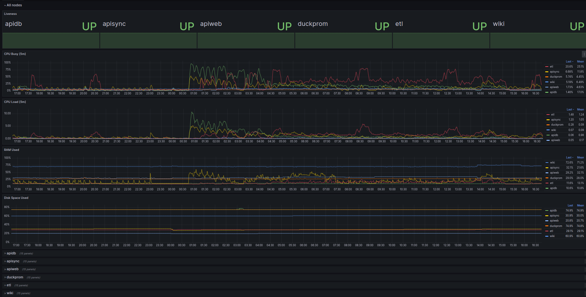

Duckprom
=========

Duckprom is solution for observation of servers with dockerized apps.

Almost the same as [dockprom](https://github.com/stefanprodan/dockprom), but there are a number of key differences:

* install and update with ansible;
* separation of server types: main and edge;
* https for grafana with [letsencrypt](https://letsencrypt.org/)
* logs with [lokki](https://grafana.com/oss/loki/)
* basic auth;
* alertmanager removed;
* [traefik](https://doc.traefik.io/traefik/) instead of [caddy](https://caddyserver.com/) .



Requirements
------------

### Docker log format

Log options for docker daemon: `"{{.ImageName}}|{{.Name}}|{{.ImageFullID}}|{{.FullID}}"` 

Example of */etc/docker/daemon.json*

```json
{
  "debug": false,
  "log-opts": {
    "tag": "{{.ImageName}}|{{.Name}}|{{.ImageFullID}}|{{.FullID}}",
    "max-size": "100m"
  }
}
```

### Nginx log format (optional)

Duckprom can scrape metrics from nginx logs with https://github.com/martin-helmich/prometheus-nginxlog-exporter.

Fix log format in nginx

```nginx
# /etc/nginx/nginx.conf

log_format upstream_time '$remote_addr - $remote_user [$time_local] '
                         '"$request" $status $body_bytes_sent '
                         '"$http_referer" "$http_user_agent" '
                         'rt=$request_time uct="$upstream_connect_time" uht="$upstream_header_time" urt="$upstream_response_time"';
access_log /var/log/nginx/access.log upstream_time;
```

Import NGINX Log Metrics into duckprom grafana.

Role Variables
--------------

```yaml
duckprom_node_type: edge
duckprom_dir: /opt/duckprom
duckprom_edge_group: edge

duckprom_basic_auth_enabled: true
duckprom_basic_auth_username: user
duckprom_basic_auth_password: secret

duckprom_traefik_image: traefik:v2.11
duckprom_traefik_https_enabled: false
duckprom_traefik_https_letsencrypt_email: me@example.com
duckprom_traefik_dashboard_enabled: false
duckprom_traefik_dashboard_port: 8080

duckprom_grafana_host: grafana.example.com
duckprom_grafana_image: grafana/grafana:10.2.4
duckprom_grafana_security_admin_user: admin
duckprom_grafana_security_admin_password: admin
duckprom_grafana_users_allow_sign_up: false

duckprom_prometheus_image: prom/prometheus:v2.49.1
duckprom_prometheus_port: 9090
duckprom_prometheus_retention: 168h
duckprom_prometheus_scrape_interval: 15s
duckprom_prometheus_evaluation_interval: 15s

duckprom_loki_image: grafana/loki:2.9.4
duckprom_loki_port: 3100
duckprom_loki_retention: 168h
# --- filesystem/s3
duckprom_loki_storage: filesystem

duckprom_loki_s3_endpoint: example.com
duckprom_loki_s3_access_key: access_key
duckprom_loki_s3_secret_key: secret_key
duckprom_loki_s3_bucketname: backetname
duckprom_loki_s3_insecure: false
duckprom_loki_s3_s3forcepathstyle: false
duckprom_loki_s3_region: ru-1


duckprom_pushgateway_enabled: true
duckprom_pushgateway_image: prom/pushgateway:v1.6.0
duckprom_pushgateway_port: 9091

duckprom_promtail_image: grafana/promtail:2.9.4

duckprom_nodeexporter_enabled: true
duckprom_nodeexporter_image: prom/node-exporter:v1.7.0
duckprom_nodeexporter_port: 9100

duckprom_cadvisor_enabled: true
duckprom_cadvisor_image: gcr.io/cadvisor/cadvisor:v0.47.2
duckprom_cadvisor_port: 9180

duckprom_nginxexporter_enabled: false
duckprom_nginxexporter_group: edge
duckprom_nginxexporter_image: quay.io/martinhelmich/prometheus-nginxlog-exporter:v1.10.0
duckprom_nginxexporter_port: 4040

duckprom_portainer_enabled: false
duckprom_portainer_image: portainer/portainer-ce:2.19.4
duckprom_portainer_host: portainer.example.com
```

Example Playbook
----------------

Inventory

```
host1    ansible_host=10.0.0.1
host2    ansible_host=10.0.0.2
host3    ansible_host=10.0.0.3

[main]
host1

[edge]
host2
host3
```

Install duckprom on main server

```yaml
---
- name: Install duckprom on main server
  hosts: main

  tasks:
    - name: Install main duckprom node
      ansible.builtin.import_role:
        name: nmix.duckprom
      vars:
        duckprom_dir: /opt/duckprom
        duckprom_node_type: main
        duckprom_traefik_https_enabled: true
        duckprom_traefik_https_letsencrypt_email: foo@example.com
        duckprom_grafana_host: grafana.example.com
        duckprom_edge_group: edge  # link to edge group for prometheus.yaml config
```

Install duckprom on edge servers

```yaml
- name: Install duckprom on edge server
  hosts: edge

  tasks:
    - name: Install edge duckprom node
      ansible.builtin.import_role:
        name: nmix.duckprom
      vars:
        duckprom_dir: /opt/duckprom
        duckprom_grafana_host: grafana.example.com  # for push logs
```

Custom targets
--------------

Your Prometheus configuration may describe various targets that are not
part of the duckprom supplied by the role.
Create a prometheus/custom.yaml file in the installation directory
(*/opt/duckprom* by default) and describe your `scrape_config` there.

License
-------

BSD
